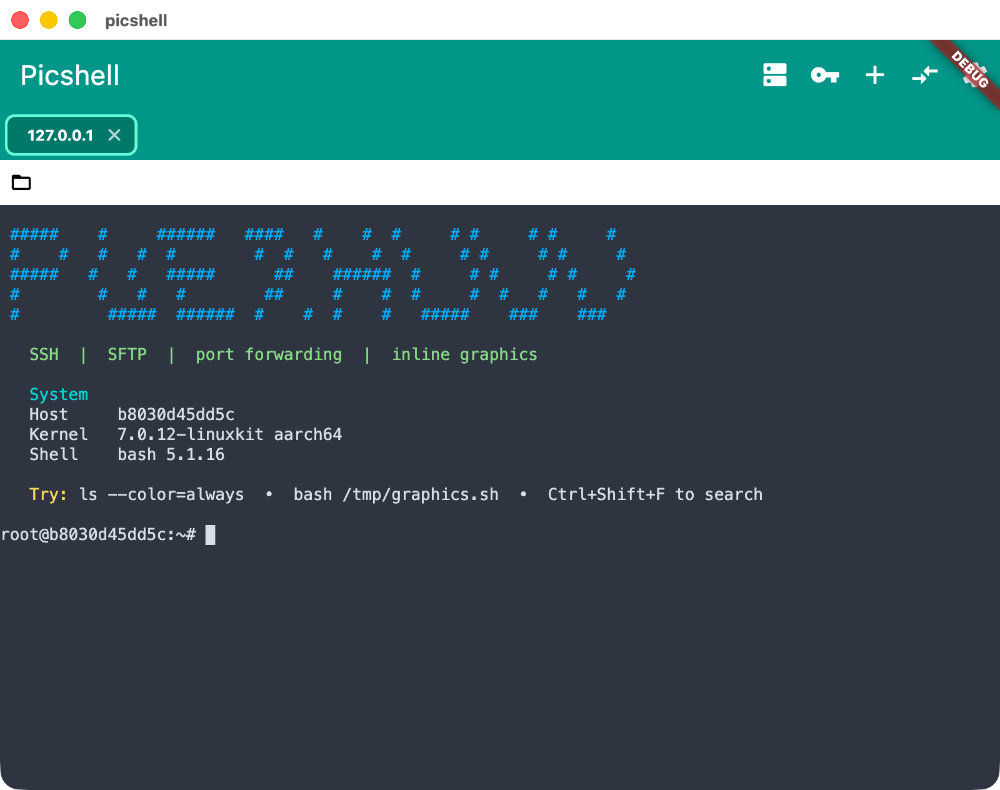
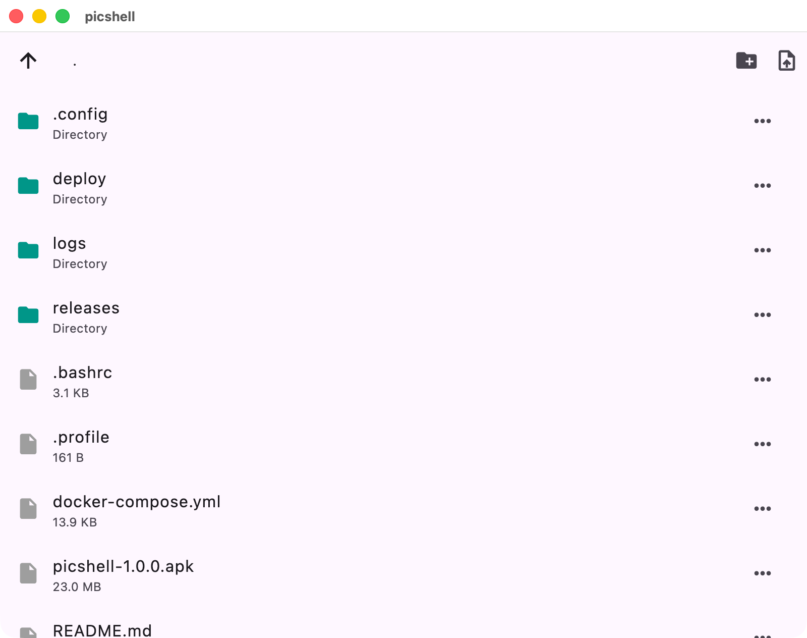
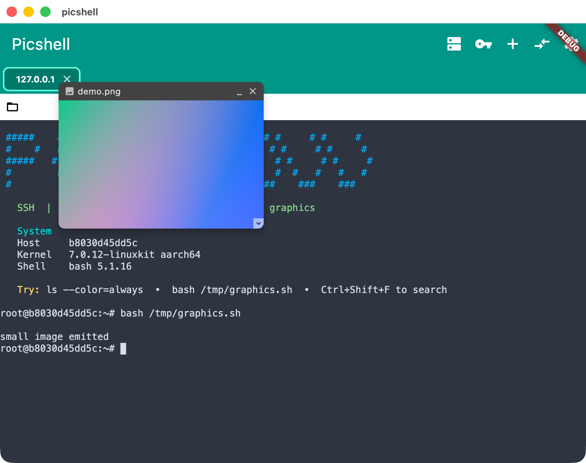
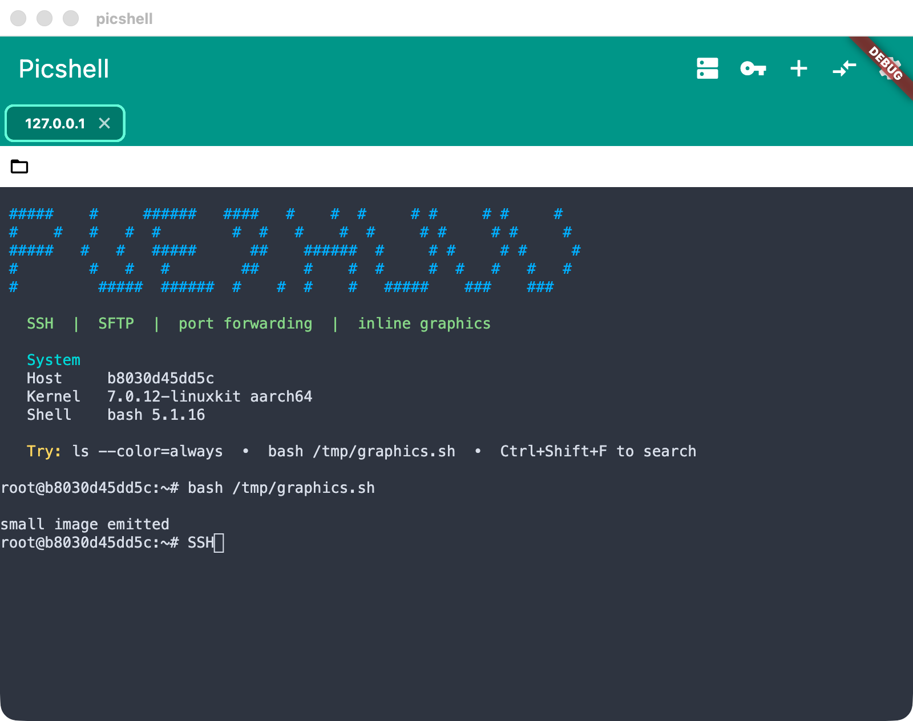

# Picshell

A cross-platform SSH client built with Flutter — terminal sessions, SFTP
browser, port forwarding and inline graphics in one app.

<p align="center">
  
</p>

## Highlights

**SSH sessions**
Password, private-key and ssh-agent authentication on dartssh2.
Trust-on-first-use host key verification shows the real
`SHA256:…` fingerprint before you trust a host, and pins it per
host/port in a local known-hosts store. Auto-reconnect uses exponential
backoff and terminal input/output survive the reconnect.

**Port forwarding**
Local (`-L`), remote (`-R`) and dynamic SOCKS5 (`-D`) forwards with
auto-start rules and a per-session status sheet. Rules re-bind
automatically when a session reconnects. ProxyJump (`ssh -J`) is
supported with per-hop host-key verification, and `~/.ssh/config`
files can be imported.

**SFTP browser**
Browse the remote filesystem, create/rename/delete files and
directories, upload and download with progress.

<p align="center">
  
</p>

**Terminal graphics**
Kitty graphics protocol, Sixel and iTerm2 OSC 1337 inline images
render as floating overlays you can drag, zoom (Option/scroll or
pinch) and resize — over the live session.

<p align="center">
  
</p>

**Scrollback search**
`Ctrl+Shift+F` opens a search bar with live match count, case/regex
toggles, next/previous navigation and streaming updates as new output
shifts the buffer.

<p align="center">
  
</p>

**Security**
Saved credentials are encrypted at rest with a device-bound master key
gated by biometrics; launch performs a verified unlock, with a
crash-safe re-encryption path and re-lock on background.

**Appearance**
8 terminal colour schemes, font family/size and line-height controls,
light/dark/system themes and a configurable virtual keyboard bar.

## Platforms

| Platform | Status |
|----------|--------|
| macOS    | ✅ supported |
| Windows  | ✅ supported |
| Linux    | ✅ supported |
| Android / iOS | supported (mobile UI adapts to touch) |

## Getting Started

### Prerequisites

- Flutter SDK (^3.12.0)

### Build & run

```bash
flutter pub get
flutter run -d macos    # or -d linux / -d windows / android / ios
```

### Tests

```bash
flutter test                                  # unit + widget tests

# Integration tests (launch the real app):
flutter test integration_test -d macos        # or -d linux / -d windows

# The SSH integration tests talk to a throwaway OpenSSH server:
docker build -t picshell-sshd -f Dockerfile.sshd .
docker run -d --name picshell-sshd -p 2222:2222 picshell-sshd
```

CI runs the unit suite plus the Android-emulator integration job on
every pull request (see `.github/workflows/`).

## Project layout

```
lib/            application code (screens, providers, services, widgets)
packages/xterm/ vendored terminal emulator fork (graphics protocols)
integration_test/  end-to-end tests driving the real app
test/           unit and widget tests
docs/           design specs and screenshots
```

## License

See [LICENSE](LICENSE).
